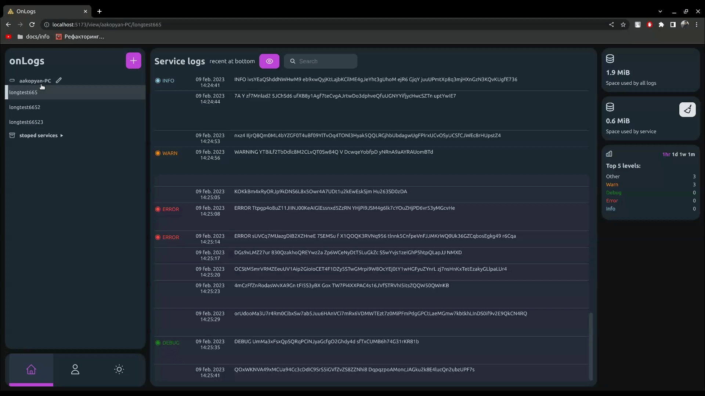

# OnLogs
<a href="https://devforth.io"></a>   

### Benefits

- 🔑 Secure and simple way to access logs without server/ssh accession
- 🏗️ Built with Golang & Svelte.js to extract maximum performance and tiny bundle. Logs storage implemented on top of LevelDB
- 🧸 Setup is easy as docker run command/compose snippet
- 🖱 Get every service realtime logs stream with 1 click 
- 📱 Check logs from smartphone (insane, but we know it happens that you need it)
- 🧾 Open-Source commercial friendly MIT license
- 💾 Small size of Docker image (~ 13 MB)
- 👥 Share access to logs with team members, revoke any time

### Features

- 💻 One host can be used to view logs from all other hosts in case if you are running Cluster
- 🔗 Share log messages to collegues via link 
- 📊 Error/Info/Debug Statistics
- 🔎 Search through logs (configurable case sensetivity)
- 👁 View parameters (parsing JSON, show local/UTC time for every logline)
- 🔴 Realtime logs updating

### Roadmap

- 💽 Clear original docker logs to avoid dublicates and doubling logs size on disk. Currently we are on MVP state.
- 🗂 Grouping hosts
- 🏷 Search & Filter by tags (log status, time)
- 🔌Plugins and internal ability to notify about some event (e.g. notify when Error happens)
- 📊 Improved statistics

## Hello world & ussage
### Docker Compose example with traefik
```sh
  onlogs:
    image: devforth/onlogs
    restart: always
    environment:
      - PASSWORD=<any password>
      - PORT=<any port>
    #  - ONLOGS_PATH_PREFIX=/<any path prefix> if using with path prefix

    ports:
      - <any port>:<any port>
    labels:
      - "traefik.enable=true"
      - "traefik.http.routers.onlogs.rule=Host(`<your host>`)"  # if using on subdomain
    #  - traefik.http.routers.onlogs.rule=PathPrefix(`</any path prefix>`) # if using with path prefix
      - "traefik.http.services.onlogs.loadbalancer.server.port=<any port>"
    volumes:
     - /var/run/docker.sock:/var/run/docker.sock
     - /etc/hostname:/etc/hostname
     - onlogs-volume:/leveldb

volumes:
  onlogs-volume:
```

### Docker Run example with traefik
```sh
docker run --restart always -e PASSWORD=<any password> -e PORT=<any port> \
    -v /var/run/docker.sock:/var/run/docker.sock:ro \
    -v /etc/hostname:/etc/hostname \
    -v onlogs-volume:/leveldb \ 
    --label traefik.enable=true \
    --label traefik.http.routers.onlogs.rule=Host\(\`<your host>\`\) \ 
    --label traefik.http.services.onlogs.loadbalancer.server.port=2874 devforth/onlogs
```

Once done, just go to <your host> and login as "admin" with <any password>.

## Available Environment Options:
| Environment Variable       | Description   | Defaults | Required |
|----------------------------|---------------------------------|--------|-----------------|
| PASSWORD           | Password for default user                        |                    | if `CLIENT=false`
| PORT               | Port to listen on                                | `2874`             | if `CLIENT=false`
| JWT_SECRET         | Secret for JWT tokens for users                  | Generates randomly | -
| ONLOGS_PATH_PREFIX | Base path if you using OnLogs not on subdomain   |                    | only if using on path prefix
| CLIENT             | Toggles client mode. If enabled, there will be no web interface available and all logs will be sent  and stored on HOST                                                      | `false` | -
| HOST               | Url to OnLogs host from protocol to domain name. |                    | if `CLIENT=true`
| ONLOGS_TOKEN       | Token that will use client to authorize and connect to HOST | Generates with OnLogs interface   | if `CLIENT=true`
