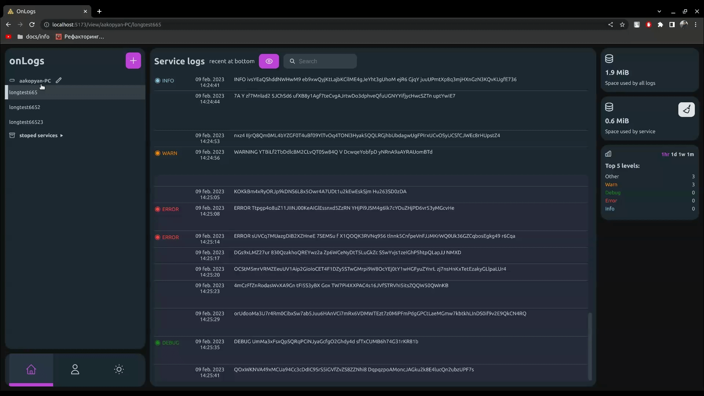

# OnLogs - Lightweight docker logs web viewer

<a href="https://devforth.io"></a>

   
[](http://tluma.ai/ask-ai/devforth/OnLogs)


### Benefits

- 🔑 Simple and secure way to access logs of any Docker containers without server/SSH connection
- 🏗️ Built with Golang & Svelte.js to extract maximum performance and keep the image and RAM footprint as small as possible. Logs storage implemented on top of lightweight LevelDB
- 🧸 Installation is easy as docker runs command/compose snippet. HTTP port exposed and could be routed from Nginx/Traefik/Directly
- 🖱 Get every service realtime logs stream with 1 click 
- 📱 Check logs from your smartphone (insane, but we know it happens that you need it)
- 🧾 Open-source, commercial-friendly MIT license
- 💾 Small size of Docker image (~ 13 MB)
- 👥 Share access to logs with team members, revoke any time

### Features

- 💻 One host can be used to view logs from all other hosts in case you are running Cluster
- 🔗 Share log messages to colleagues via link 
- 💽 Clear original docker logs to keep your storage size.
- 📊 Error/Info/Debug Statistics
- 🔎 Search through logs (configurable case sensitivity)
- 👁 View parameters (parsing JSON, showing local/UTC time for every logline)
- 🔴 Realtime logs updating
- 🗂 Group services into named folders in the sidebar, per user
- 📈 Prometheus metrics endpoint for log volume and OnLogs' own health

### Roadmap

- 🏷 Search and filter by tags (log status, time)
- 🔌Plugins and internal ability to notify about some event (e.g. notify when Error happens)

## Hello world & usage
### Docker Compose example with traefik
```sh
  onlogs:
    image: devforth/onlogs
    restart: always
    environment:
      - ADMIN_USERNAME=admin
      - ADMIN_PASSWORD=<any password>
      - PORT=8798
    #  - ONLOGS_PATH_PREFIX=/onlogs if want to use with path prefix

    labels:
      - "traefik.enable=true"
      - "traefik.http.routers.onlogs.rule=Host(`<your host>`)"  # if using on subdomain, e.g. https://onlogs.yourdomain.com
    #  - traefik.http.routers.onlogs.rule=PathPrefix(`/onlogs`) # if want to use with a path prefix, e.g. https://yourdomain.com/onlogs
      - "traefik.http.services.onlogs.loadbalancer.server.port=8798"
    volumes:
     - /var/run/docker.sock:/var/run/docker.sock
     - /var/lib/docker/containers:/var/lib/docker/containers # if you want to delete duplicating logs from docker
     - /etc/hostname:/etc/hostname
     - onlogs-volume:/leveldb

volumes:
  onlogs-volume:
```

### Docker Run example with traefik
```sh
docker run --restart always -e ADMIN_USERNAME=admin -e ADMIN_PASSWORD=<any password> -e PORT=8798 \
    -v /var/run/docker.sock:/var/run/docker.sock:ro \
    -v /var/lib/docker/containers:/var/lib/docker/containers \
    -v /etc/hostname:/etc/hostname \
    -v onlogs-volume:/leveldb \ 
    --label traefik.enable=true \
    --label traefik.http.routers.onlogs.rule=Host\(\`<your host>\`\) \ 
    --label traefik.http.services.onlogs.loadbalancer.server.port=8798 devforth/onlogs
```

Once done, just go to <your host> and login as "admin" with <any password>.

## Available Environment Options:
| Environment Variable       | Description   | Defaults | Required |
|----------------------------|---------------------------------|--------|-----------------|
| DOCKER_HOST              | URL of the docker socket to connect to. See below | `unix:///var/run/docker.sock` | |
| ADMIN_USERNAME           | Username for initial user                        | `admin`                 | if `AGENT=false`
| ADMIN_PASSWORD           | Password for initial user. Must not be empty — OnLogs refuses to start without it unless `DISABLE_AUTH=true` |                    | if `AGENT=false`
| PORT               | Port to listen on                                | `2874`             | if `AGENT=false`
| JWT_SECRET         | Secret for JWT tokens for users. Generated with `crypto/rand` on first start and persisted to `leveldb/JWT_secret`. Set it explicitly if you want sessions to survive the volume being recreated | Generates randomly | -
| ONLOGS_PATH_PREFIX | Base path if you using OnLogs not on subdomain   |                    | only if using on path prefix
| AGENT             | Toggles agent mode. If enabled, there will be no web interface available, and all logs will be sent  and stored on HOST. Parsed as a boolean, so `false`, `0` and an unset value all mean off | `false` | -
| HOST               | Url to OnLogs host from protocol to domain name. |                    | if `AGENT=true`
| ONLOGS_TOKEN       | Token that will use an agent to authorize and connect to HOST | Generates with OnLogs interface   | if `AGENT=true`
| MAX_LOGS_SIZE | Maximum allowed total logs size before cleanup triggers. Accepts human-readable formats like 5GB, 500MB, 1.5GB etc. When exceeded, 10% of logs (by count) will be removed proportionally across containers starting from oldest. Validated at startup: an unparseable value stops OnLogs rather than silently disabling retention | 10GB | -
| DISABLE_AUTH | Option to completely disable built in authentication in the application. When this option is set to `true` the app will behave like if the Administrator is logged in. The option to manage users will be removed. | false | -
| METRICS_TOKEN | Bearer token for the Prometheus endpoint at `/api/v1/metrics`. While it is unset the endpoint returns `401` and exposes nothing, so metrics are off by default. See [Metrics](#metrics) | | only for `/api/v1/metrics`

## Metrics

Prometheus metrics at `${ONLOGS_PATH_PREFIX}/api/v1/metrics`. Set `METRICS_TOKEN` to enable
them — while it is unset every request gets a `401`, since the endpoint reveals container
names and log volumes.

```yaml
scrape_configs:
  - job_name: onlogs
    metrics_path: /api/v1/metrics
    authorization:
      credentials: <your METRICS_TOKEN>
    static_configs:
      - targets: ["onlogs:2874"]
```

| metric | labels | meaning |
|---|---|---|
| `onlogs_log_lines_total` | host, container, level | Log lines stored, by severity |
| `onlogs_stream_up` | host, container | 1 while a container's stream is attached |
| `onlogs_stream_cursor_timestamp_seconds` | host, container | Newest line ingested |
| `onlogs_dropped_replay_lines_total` | host, container | Lines dropped as replays |
| `onlogs_logs_size_bytes` / `_limit_bytes` | | Stored size, and `MAX_LOGS_SIZE` |
| `onlogs_container_db_size_bytes` | host, container | Stored size per container |
| `onlogs_retention_deleted_lines_total` | | Lines deleted by the quota |
| `onlogs_filesystem_size_bytes` / `_avail_bytes` | | The filesystem holding the logs |
| `onlogs_stats_workers`, `onlogs_websocket_connections` | | Workers and live viewers |
| `onlogs_goroutines`, `onlogs_heap_bytes` | | Process health |
| `onlogs_login_failures_total`, `onlogs_login_blocked_total` | | Rejected and blocked logins |
| `onlogs_build_info` | version | Always 1 |

Alert on error rate, and on ingestion stalling while lines are still arriving:

```yaml
- alert: OnLogsContainerErrors
  expr: sum by (host, container) (rate(onlogs_log_lines_total{level="error"}[5m])) > 1
  for: 10m

- alert: OnLogsIngestStalled
  expr: |
    (time() - onlogs_stream_cursor_timestamp_seconds > 300)
      and on (host, container) (rate(onlogs_log_lines_total[10m]) > 0)
  for: 5m
```

Worth knowing: `onlogs_stream_up` covers local containers only, not agent-forwarded ones;
size gauges refresh every 5 minutes and the limit is read once at startup; counters reset
on restart, as usual; and at most 1000 host/container pairs are counted.

## Upgrading from 1.x

Your logs are safe — nothing in the volume is migrated or deleted.

**Check these three first, or the container will not start:**

| Variable | What changed |
|---|---|
| `ADMIN_PASSWORD` | Must not be empty, unless `DISABLE_AUTH=true`. The 1.3.1 `docker run` example set `PASSWORD=` by mistake — if you copied it, fix the name. |
| `MAX_LOGS_SIZE` | Must be a valid size if you set it. Leaving it unset is fine. |
| `AGENT` | Now a real boolean. `AGENT=false` used to mean *on*, so you may have been running without a web interface by accident. `yes` and `on` no longer work. |

**Everyone is logged out once.** 1.3.1 signed sessions with an empty key, which anyone
could forge. A real secret is generated on first start — set `JWT_SECRET` yourself if you
want sessions to survive the volume being recreated.

Smaller changes: passwords are now hashed (rotate them if the database may have been
exposed); favourites are per user and need starring again; log levels are matched
case-insensitively, so charts change shape at the upgrade; live tailing needs your reverse
proxy to forward the original `Host` header.

## Docker socket URL
By default the app will connect using the raw unix socket. But this can be overriden via the ENV variable `DOCKER_HOST`. That way you can specify fully qualified URL to the socket or URL of an docker socket proxy.

In `compose-socket-proxy.yml` you can see a sample compose file for starting the socket proxy. To use it in the app set `DOCKER_HOST=http://localhost:2375` in the ENV.

## Local Docker testing

Use the local test compose to run `onlogs + socket-proxy + logprinter` together:

```sh
cd application
docker compose -f compose-local-test.yml up --build
```

Open `http://localhost:2874` and login with:

- Username: `admin`
- Password: `admin`

Stop containers:

```sh
docker compose -f compose-local-test.yml down
```

Stop and remove volumes too (clean state):

```sh
docker compose -f compose-local-test.yml down -v
```
