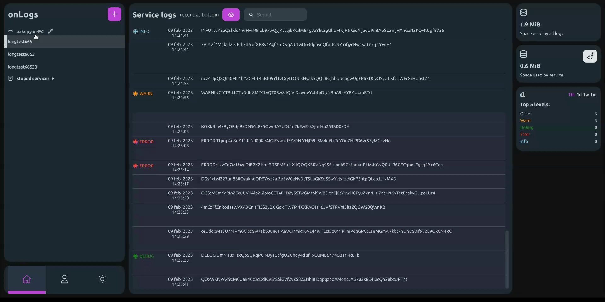

# OnLogs - Lightweight docker logs web viewer

<a href="https://devforth.io"></a>

   


### Benefits

- 🔑 Simple and secure way to access logs of any Docker containers without server/SSH connection
- 🏗️ Built with Golang & Svelte.js to extract maximum performance and keep the image and RAM footprint as small as possible. Logs storage implemented on top of lightweight LevelDB
- 🧸 Installation is easy as docker runs command/compose snippet. HTTP port exposed and could be routed from Nginx/Traefik/Directly
- 🖱 Get every service realtime logs stream with 1 click 
- 📱 Check logs from your smartphone (insane, but we know it happens that you need it)
- 🧾 Open-source, commercial-friendly MIT license
- 💾 Small size of Docker image (~ 13 MB)
- 👥 Share access to logs with team members, revoke any time

### Features

- 💻 One host can be used to view logs from all other hosts in case you are running Cluster
- 🔗 Share log messages to colleagues via link 
- 💽 Clear original docker logs to keep your storage size.
- 📊 Error/Info/Debug Statistics
- 🔎 Search through logs (configurable case sensitivity)
- 👁 View parameters (parsing JSON, showing local/UTC time for every logline)
- 🔴 Realtime logs updating

### Roadmap

- 🗂 Grouping hosts
- 🏷 Search and filter by tags (log status, time)
- 🔌Plugins and internal ability to notify about some event (e.g. notify when Error happens)
- 📊 Improved statistics

## Hello world & usage
### Docker Compose example with traefik
```sh
  onlogs:
    image: devforth/onlogs
    restart: always
    environment:
      - ADMIN_USERNAME=admin
      - ADMIN_PASSWORD=<any password>
      - PORT=8798
    #  - ONLOGS_PATH_PREFIX=/onlogs if want to use with path prefix

    labels:
      - "traefik.enable=true"
      - "traefik.http.routers.onlogs.rule=Host(`<your host>`)"  # if using on subdomain, e.g. https://onlogs.yourdomain.com
    #  - traefik.http.routers.onlogs.rule=PathPrefix(`/onlogs`) # if want to use with a path prefix, e.g. https://yourdomain.com/onlogs
      - "traefik.http.services.onlogs.loadbalancer.server.port=8798"
    volumes:
     - /var/run/docker.sock:/var/run/docker.sock
     - /var/lib/docker/containers:/var/lib/docker/containers # if you want to delete duplicating logs from docker
     - /etc/hostname:/etc/hostname
     - onlogs-volume:/leveldb

volumes:
  onlogs-volume:
```

### Docker Run example with traefik
```sh
docker run --restart always -e ADMIN_USERNAME=admin -e PASSWORD=<any password> -e PORT=8798 \
    -v /var/run/docker.sock:/var/run/docker.sock:ro \
    -v /var/lib/docker/containers:/var/lib/docker/containers \
    -v /etc/hostname:/etc/hostname \
    -v onlogs-volume:/leveldb \ 
    --label traefik.enable=true \
    --label traefik.http.routers.onlogs.rule=Host\(\`<your host>\`\) \ 
    --label traefik.http.services.onlogs.loadbalancer.server.port=8798 devforth/onlogs
```

Once done, just go to <your host> and login as "admin" with <any password>.

## Available Environment Options:
| Environment Variable       | Description   | Defaults | Required |
|----------------------------|---------------------------------|--------|-----------------|
| ADMIN_USERNAME           | Username for initial user                        | `admin`                 | if `AGENT=false`
| ADMIN_PASSWORD           | Password for initial user                        |                    | if `AGENT=false`
| PORT               | Port to listen on                                | `2874`             | if `AGENT=false`
| JWT_SECRET         | Secret for JWT tokens for users                  | Generates randomly | -
| ONLOGS_PATH_PREFIX | Base path if you using OnLogs not on subdomain   |                    | only if using on path prefix
| AGENT             | Toggles agent mode. If enabled, there will be no web interface available, and all logs will be sent  and stored on HOST                                                      | `false` | -
| HOST               | Url to OnLogs host from protocol to domain name. |                    | if `AGENT=true`
| ONLOGS_TOKEN       | Token that will use an agent to authorize and connect to HOST | Generates with OnLogs interface   | if `AGENT=true`
| MAX_LOGS_SIZE | Maximum allowed total logs size before cleanup triggers. Accepts human-readable formats like 5GB, 500MB, 1.5GB etc. When exceeded, 30% of logs (by count) will be removed proportionally across containers starting from oldest | 5GB | -
